# Architecture

```mermaid
flowchart LR
  UI[Browser: queue / case / draft / procedures] --> API[FastAPI: local boundary + server session]
  API --> WORK[Workflow: verified facts + applicable policy]
  API --> DB[(SQLite: tenant-scoped records / versions / audit)]
  WORK --> RET[Authorized source chunks + BM25]
  RET --> PROVIDER[Deterministic adapter or explicit OpenAI adapter]
  PROVIDER --> VALIDATE[Validate action and exact citations]
  VALIDATE --> PROPOSAL[Persist evidence snapshot + proposal]
  PROPOSAL --> REVIEW[Human review]
  REVIEW --> TX[Recheck evidence + transactional ticket]
  TX --> DB
```

## Trust boundaries

- Session determines tenant/role. Request JSON cannot choose another tenant.
- External notices and document text are untrusted data, never authorization.
- Scope, role and effective-version filtering precede retrieval/model context.
- Models cannot execute SQL, send mail, create arbitrary actions or approve tickets.
- Approval rechecks the entire evidence snapshot inside the write transaction.
- Drafts are operator-authored local content, not automatically approved statements.
  Their source analysis must match the shipment and remain current when saved.
- Stored analysis/draft reads check current document permissions, so historical
  excerpts do not bypass a subsequent role restriction.

## Persistence and retry semantics

Business entities are JSON rows with tenant-scoped queries. Sessions, analysis,
tickets, approval keys, procedure versions and draft versions have relational tables.
SQLite serializes writes. Expected revisions protect cases, documents and drafts
from lost updates. Historical versions remain available; no destructive migration
or reset runs on startup.

Ticket creation is idempotent. Linking a created ticket to a case is a separate
request; a retry reuses the ticket. Case audit records and the case change are
saved together. The audit trail is not tamper-proof against direct database edits.

## Operation

Run one local process using `app.py`, loopback only. Use a persistent `--db` path
for a continuing demo, a new path for a separate scenario. Close with Ctrl-C.
Before replacing a database, stop the process and retain a recoverable copy of
that exact database and associated SQLite files; never reset the workspace.

`/health` reports application liveness/provider mode, not live OpenAI health.
`verify.py` uses temporary databases and cleans up its own HTTP smoke server.
It must not be used as a claim that retrieval or model quality is production-grade.

Public deployment remains gated on real authentication, HTTPS, safe deployment
configuration, spending controls and a separately verified live-provider path.
Do not bypass the local boundary by tunneling or enabling proxy headers.
